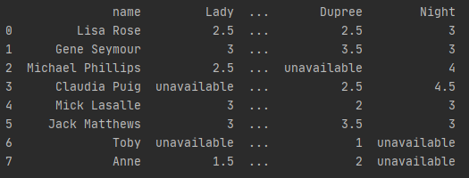

## Decision Modelling. Assignment 4. Collaborative Filtering
1. For containing film critics and their ratings pandas.DataFrame was used.  

    

2.  (a) People similar to Anne (`sim_distance()`)    
        ```
        [(1.0, 'Michael Phillips'), (1.0, 'Toby'), (1.5, 'Claudia Puig'),
        (2.5, 'Lisa Rose'), (3.0, 'Jack Matthews'), (3.5, 'Mick Lasalle'),
        (5.5, 'Gene Seymour')]  
        ```  
    (b) Film recommended by the nearest neighbour of Toby (`recommendNearestNeighbour()`)  
        `[('Lady', 1.5), ('Luck', 4.0)]`  
    (c) i. Recommend Anne a film using s'  
            `['Superman']`  
        ii. Recommend Anne a film using s'_exp  
            `['Night']`  
    (d) Recommend Anne a film using Pearson coefficient  
        `['Superman']`  
    (e) Recommend Anne a film using cosine coefficient  
        `['Superman']`  
3. Test again with the music dataset.  
    Musicians recommended to Veronica:  
    ```
    s_prime:  ['Norah Jones']  
    s_prime_exp:  ['Norah Jones']  
    Pearson coefficient:  ['Phoenix']  
    Cosine coefficient:  ['Phoenix']  
    ```
    Musicians recommended to Hailey:  
    ```
    s_prime:  ['Phoenix']  
    s_prime_exp:  ['Phoenix']  
    Pearson coefficient:  []  
    Cosine coefficient:  ['Phoenix']  
    ```
4. Example was generated using a function `collabfilter.conditions.condition1` (`super-duper-random-definitely-unbiased-data1.csv`)  
5. Example was generated using a function `collabfilter.conditions.condition2` (`super-duper-random-definitely-unbiased-data2.csv`)
